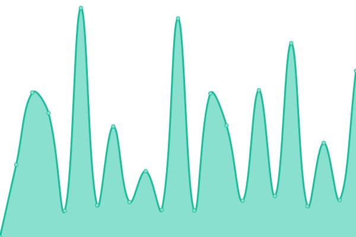
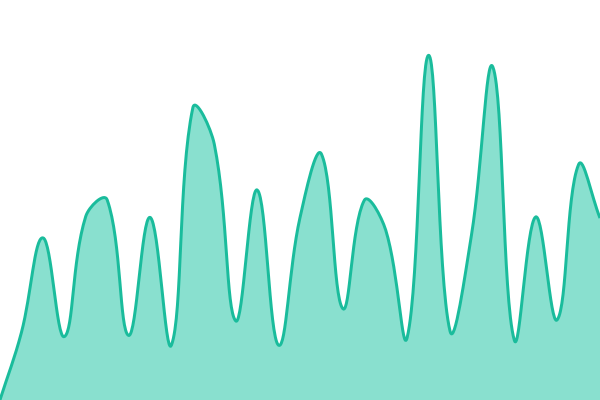
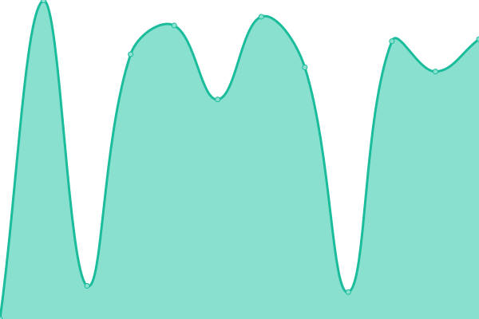
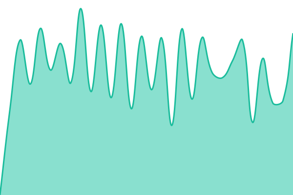
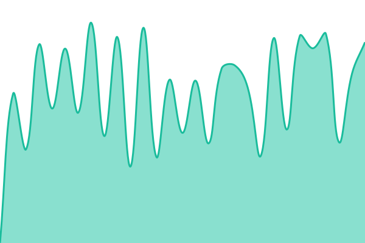

# [📈 Live Status](https://WebGuyJeff.github.io/my-site-uptime-monitor): <!--live status--> **🟩 All systems operational**

This repository contains the open-source uptime monitor and status page for [WebGuyJeff](https://WebGuyJeff.github.io/my-site-uptime-monitor), powered by [Upptime](https://github.com/upptime/upptime).

With [Upptime](https://upptime.js.org), you can get your own unlimited and free uptime monitor and status page, powered entirely by a GitHub repository. We use [Issues](https://github.com/WebGuyJeff/my-site-uptime-monitor/issues) as incident reports, [Actions](https://github.com/WebGuyJeff/my-site-uptime-monitor/actions) as uptime monitors, and [Pages](https://WebGuyJeff.github.io/my-site-uptime-monitor) for the status page.

<!--start: status pages-->
<!-- This summary is generated by Upptime (https://github.com/upptime/upptime) -->
<!-- Do not edit this manually, your changes will be overwritten -->
<!-- prettier-ignore -->
| URL | Status | History | Response Time | Uptime |
| --- | ------ | ------- | ------------- | ------ |
|  [Web Guy Jeff](https://webguyjeff.com) | 🟩 Up | [web-guy-jeff.yml](https://github.com/WebGuyJeff/my-site-uptime-monitor/commits/HEAD/history/web-guy-jeff.yml) | 

 1472ms
     
 | 

<a href="https://WebGuyJeff.github.io/my-site-uptime-monitor/history/web-guy-jeff">94.55%</a>
    

|  [Bigup Web](https://bigupweb.com) | 🟩 Up | [bigup-web.yml](https://github.com/WebGuyJeff/my-site-uptime-monitor/commits/HEAD/history/bigup-web.yml) | 

 1270ms
     
 | 

<a href="https://WebGuyJeff.github.io/my-site-uptime-monitor/history/bigup-web">94.55%</a>
    

|  [Kelly Lloyd Therapy](https://kellylloydtherapy.co.uk/) | 🟩 Up | [kelly-lloyd-therapy.yml](https://github.com/WebGuyJeff/my-site-uptime-monitor/commits/HEAD/history/kelly-lloyd-therapy.yml) | 

 1386ms
     
 | 

<a href="https://WebGuyJeff.github.io/my-site-uptime-monitor/history/kelly-lloyd-therapy">94.55%</a>
    

|  [Breeze Medical Invoicing](https://breezemedicalinvoicing.com) | 🟩 Up | [breeze-medical-invoicing.yml](https://github.com/WebGuyJeff/my-site-uptime-monitor/commits/HEAD/history/breeze-medical-invoicing.yml) | 

 2136ms
     
 | 

<a href="https://WebGuyJeff.github.io/my-site-uptime-monitor/history/breeze-medical-invoicing">94.54%</a>
    

|  [Barrs Barking Salon](https://barrsbarkingsalon.co.uk) | 🟩 Up | [barrs-barking-salon.yml](https://github.com/WebGuyJeff/my-site-uptime-monitor/commits/HEAD/history/barrs-barking-salon.yml) | 

 1227ms
     
 | 

<a href="https://WebGuyJeff.github.io/my-site-uptime-monitor/history/barrs-barking-salon">94.54%</a>
    

|  [Nightingale Mortgage Consultants](https://nightingalemortgageconsultants.com/) | 🟩 Up | [nightingale-mortgage-consultants.yml](https://github.com/WebGuyJeff/my-site-uptime-monitor/commits/HEAD/history/nightingale-mortgage-consultants.yml) | 

 1178ms
     
 | 

<a href="https://WebGuyJeff.github.io/my-site-uptime-monitor/history/nightingale-mortgage-consultants">94.54%</a>
    

|  [Bespoke 4 joinery](https://bespoke4joinery.co.uk) | 🟩 Up | [bespoke-4-joinery.yml](https://github.com/WebGuyJeff/my-site-uptime-monitor/commits/HEAD/history/bespoke-4-joinery.yml) | 

 631ms
     
 | 

<a href="https://WebGuyJeff.github.io/my-site-uptime-monitor/history/bespoke-4-joinery">94.54%</a>
    

|  [TSO LTD](https://tso-ltd.co.uk/) | 🟩 Up | [tso-ltd.yml](https://github.com/WebGuyJeff/my-site-uptime-monitor/commits/HEAD/history/tso-ltd.yml) | 

 609ms
     
 | 

<a href="https://WebGuyJeff.github.io/my-site-uptime-monitor/history/tso-ltd">100.00%</a>
    

<!--end: status pages-->

[**Visit our status website →**](https://WebGuyJeff.github.io/my-site-uptime-monitor)

## 📄 License

- Powered by: [Upptime](https://github.com/upptime/upptime)
- Code: [MIT](./LICENSE) © [WebGuyJeff](https://WebGuyJeff.github.io/my-site-uptime-monitor)
- Data in the `./history` directory: [Open Database License](https://opendatacommons.org/licenses/odbl/1-0/)
